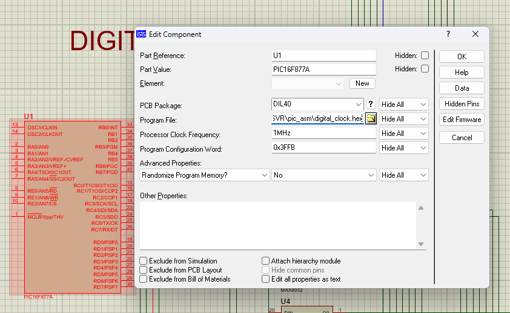
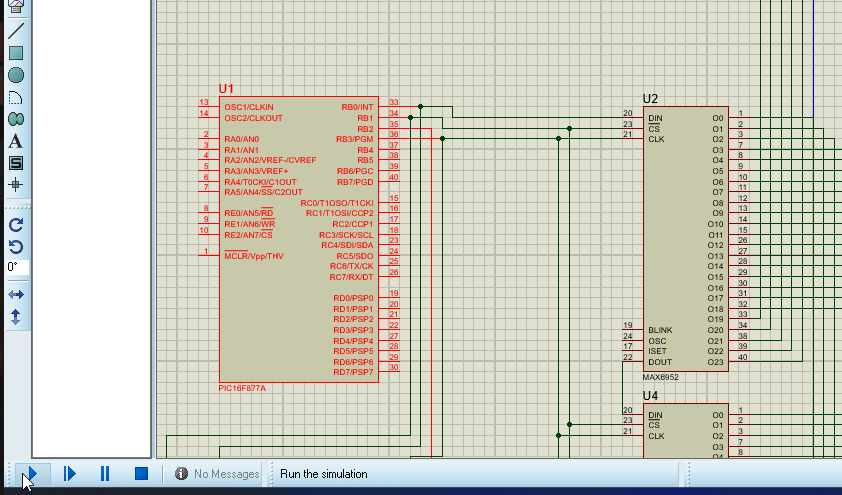
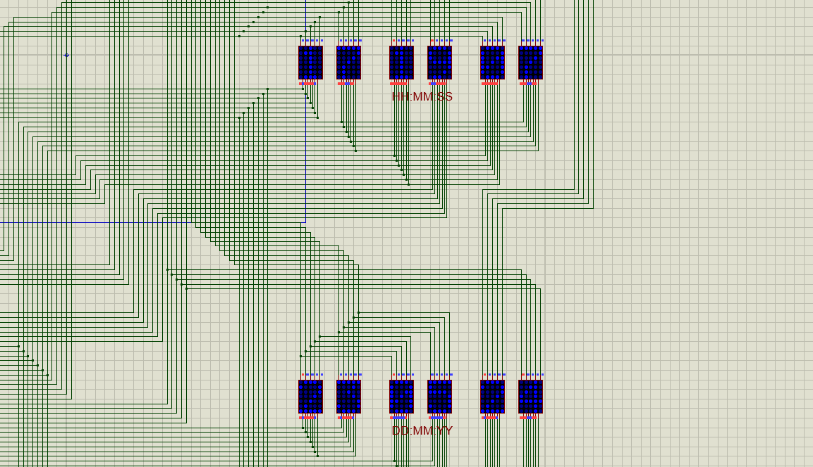
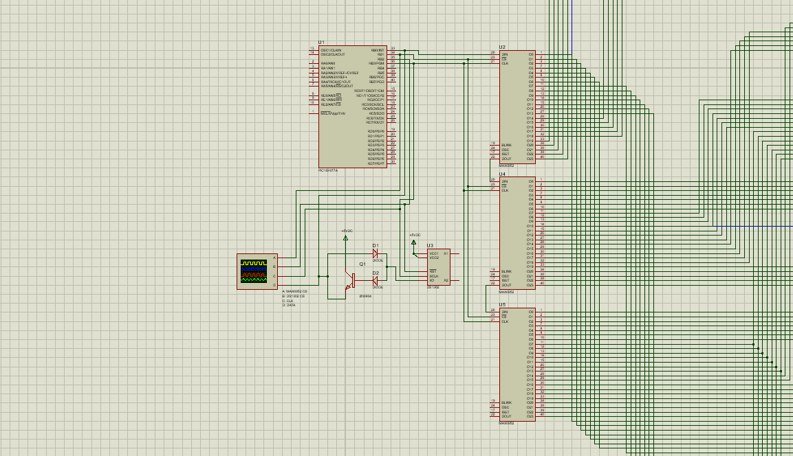
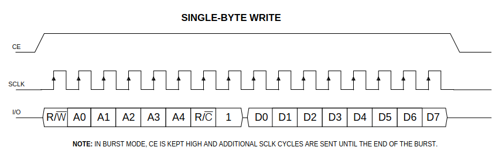
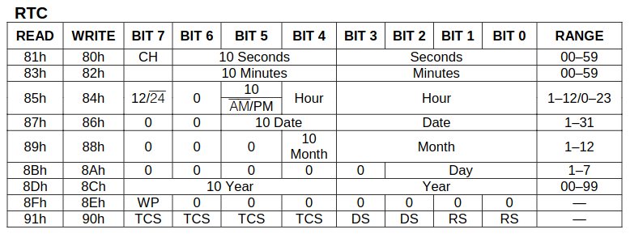
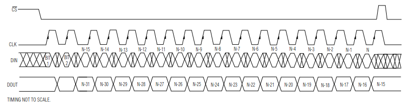
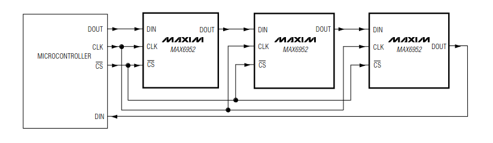

# PIC Digital Clock ⏰


💸 Please consider donating on [PayPal](https://www.paypal.com/donate/?hosted_button_id=4EWXTWQ9FUFLA) to keep this project alive.

---

This project intended to create a digital clock using the PIC16F877a from Assembly. The design uses MAX6972 for driving a display and DS1302 to get the real-time clock. Three MAX6972s drive 12 5x7 dot-matrix displays. All code is written in Assembly to get an understanding of the PIC assembly.

## Prerequisites ⏰

To understand this project, somewhat knowledge of the PIC assembly is required. A good resource is the PIC16F877a [documentation](https://ww1.microchip.com/downloads/en/devicedoc/39582b.pdf). Somewhat knowledge of communication protocols is also required. This is crucial to understand how to communicate with the MAX6972 and DS1302. The specifics of the communication can be found in their respective documentation: [MAX6972](https://www.analog.com/media/en/technical-documentation/data-sheets/MAX6952.pdf) and [DS1302](https://www.analog.com/media/en/technical-documentation/data-sheets/DS1302.pdf).

For development, [VS Code](https://code.visualstudio.com/download) is used. ASM Code Lens extension is optional for syntax highlighting in VS Code for Assembly. [Proteus 8](https://www.labcenter.com/) is used for simulation. For compiling the code, [XC8](https://www.microchip.com/en-us/tools-resources/develop/mplab-xc-compilers/xc8) is used which is the compiler set provided by PIC for all their chips.

## Getting Started ⏰
The first step is to install all the prerequisites given above. This example is done in Ubuntu but any other operating system is compatible given you follow the correct install instructions provided by the vendors of these applications. Finally, clone or download this repository to your computer.

## Repository Content ⏰

The repository contains the assembly code for the digital clock in the **digital_clock.S** file. The compiled hex code is in the **digital_clock.hex** file. All other files titled **digital_clock** are intermediate compiler files. The proteus simulation is in the **Digital_Clock.pdsprj** file.

## Compiling the Code ⏰

The code is already compiled and the output hex file is titled **digital_clock.hex**. To recompile, first find where the PIC assembler is installed. In Ubuntu, this is in */opt/microchip/xc8/v2.46/pic-as/bin/pic-as*. For other operating systems, refer to the documentation. Once found, open a terminal within the repository and enter the below command to validate that the compiler exists.

```
/opt/microchip/xc8/v2.46/pic-as/bin/pic-as --version
```

This should output something similar to below.

```
MPLAB XC8 PIC(R) Assembler V2.46
Build date: Jan  4 2024
Copyright (C) 2024 Microchip Technology Inc.
```

To compile, enter the command below.

```
/opt/microchip/xc8/v2.46/pic-as/bin/pic-as -mcpu=16F877A ./digital_clock.S
```

This should output something similar to below.

```
::: advisory: (2100) using the C99 standard library with the selected device may result in larger code and data usage

Memory Summary:
    Program space        used    CEh (   206) of  2000h words   (  2.5%)
    Data space           used     0h (     0) of   170h bytes   (  0.0%)
    EEPROM space         used     0h (     0) of   100h bytes   (  0.0%)
    Configuration bits   used     1h (     1) of     1h word    (100.0%)
    ID Location space    used     0h (     0) of     4h bytes   (  0.0%)
```

## Simulation ⏰

Open Proteus 8 and open the **Digital_Clock.pdsprj** in the **Proteus_Simulation** folder. Double-click on the PIC16F877a and in the *Edit Component* menu, click on the folder icon next to the *Program File:* option.



Navigate to the repository and choose the **digital_clock.hex** file and click **OK**. Click on the **Run the simulation** button in the bottom-left corner.



This should run the simulation and show the program running in the PIC.



## Hardware ⏰

The proteus simulation makes use of several hardware components.
- PIC16F877a * 1
- MAX6952 * 2
- DS1302 * 1
- 5x7 Blue Matrix Display * 12
- Generic Diode * 2
- 2N3904 Transistor * 1
- Oscilloscope * 1



The PIC16F877a will be the microcontroller that controls the system. The three MAX6952 will drive the 5x7 matrix displays individually. These three MAX6952s are daisy-chained together for easy communication.

The DS1302 is also connected to the PIC16F877a. It goes through a simple voltage translator. This is because the PIC16F877a expects signals in 5V while the DS1302 communicates at 2V.

The four signals present: MAX6952 Chip Select, DS1302 Chip Select, Common Clock and Common Data are connected in that order to the Yellow, Blue, Red and Green leads of the oscillator.

## Firmware ⏰

The program first initializes the MAX6952 chips. Next, it enters a loop where it first sends commands, receives data from the DS1302 and sends data to individual MAX6952s. Remember, each MAX6952 can handle 4 digits. However, since we have the chips daisy-chained, only one of each digit of the 3 chips can be controlled at once. Also, each parameter: hours, minutes, seconds, date, month and year is taken for two digits.

### Data RX/TX

In the first stage, the date and seconds are received. The 2 digits of the date and 1st digit of the seconds are loaded to the first digits of each MAX6952 by bit-shifting.

In the second stage, the minutes are received. The 2 digits of the minutes and 2nd digit of the seconds are loaded to the second digits of each MAX6952 by bit-shifting.

In the third stage, the month and hour are received. The 2 digits of the month and 1st digit of the hour are loaded to the second digits of each MAX6952 by bit-shifting.

In the fourth stage, the year is received. The 2 digits of the year and 2nd digit of the hour are loaded to the third digits of each MAX6952 by bit-shifting.

### DS1302 Communication

In DS1302, communication is done by first sending 8 bits with the command and then receiving the reply as 8 bits. This is the form below.



Each command/data will correspond to each parameter as given below.



For example, to read the seconds, command **0x81 (1000 0001)** is sent. In the next immediate clock cycle, 8 bits are read from the data line. These 8 bits are first filtered by **0x0F (0000 1111)** to get the lower digit and then nibble rotated, filtered by **0x07 (0000 0111)** to get the upper digit. This is true for hours, minutes, dates, months and years as well.

> Note that for higher 4 bits, (the upper digit) bit 7 is always discarded. This is to be safe from reading CH and 12/24 status as part of the number. However, this means that for years, after 2079, the value rolls back to 2000. This is a bug that exist in this code, however, it won't be affected until 2080.

Additionally, **0x30 (0011 0000)** is added to get the correct character code of the number for the MAX6972, which has the digits at an offset of 0x30. Refer to *table 14. Character Map* in the MAX6952 datasheet.

### MAX6952 Communication

Communication to MAX6952 happens similarly. However, instead of sending 8 bits and receiving 8 bits, 16 * 3 bits are sent. Each 16 bits corresponds to an 8-bit command-data pair for each chip.



This is because the three MAX6952s are daisy-chained together. All bits must shift across to the last chip's last digit one after the other.



There are four commands we send to each MAX6952.
- Configuration - 0x04
- Intensity 10 - 0x01
- Intensity 32 - 0x02
- D0 address - 0x20
- D1 address - 0x21
- D2 address - 0x22
- D3 address - 0x23

The configuration is to configure the display. The default 0f 0x81 is sent along with the command. Intensity 10 and 32 are defaulted to 0xFF for maximum brightness. Additionally, 0xFF is sent to all D0, D1, D2 and D3 to clear the displays. This concludes the initialization.

For each digit, the resulting digit from the DS1302 is sent with the command corresponding to the relevant address of the digit. Refer to *table 4. Register Address Map* in the MAX6952 datasheet.

## License ⏰

> PIC Digital Clock is licensed under the GNU General Public License v3.0.

Permissions of this strong copyleft license are conditioned on making available the complete source code of licensed works and modifications, which include larger works using a licensed work, under the same license. Copyright and license notices must be preserved. Contributors provide an express grant of patent rights.

### Permissions

✔️ Commercial Use | Modification | Distribution | Patent Use | Private Use

### Limitations

❌ Liability | Warranty

### Conditions

ℹ️ License and Copyright Notice | State Changes | Disclose Source | Same License

Refer to the [License declaration](./LICENSE) for more details.

`© 2024 Asanka Sovis`